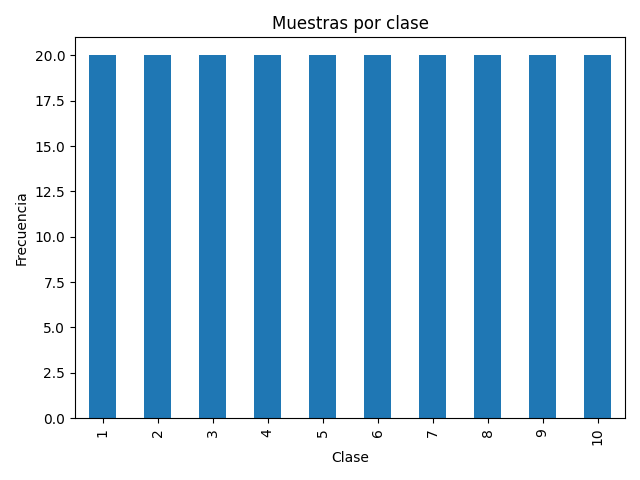
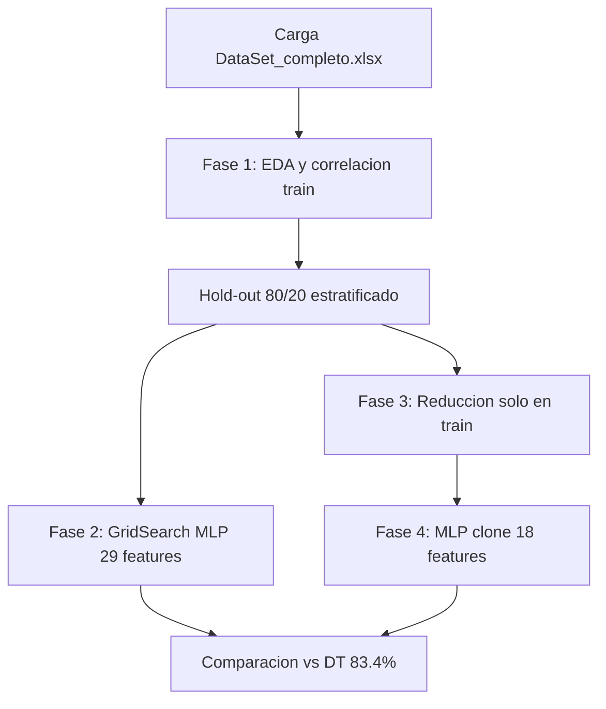
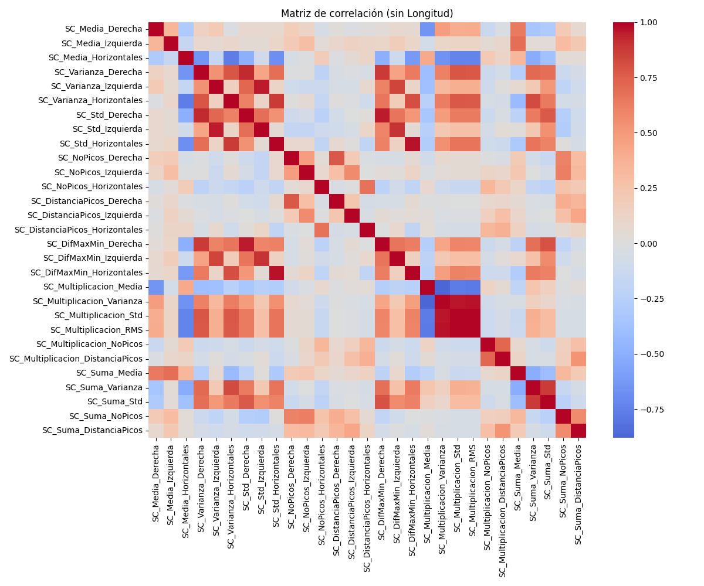
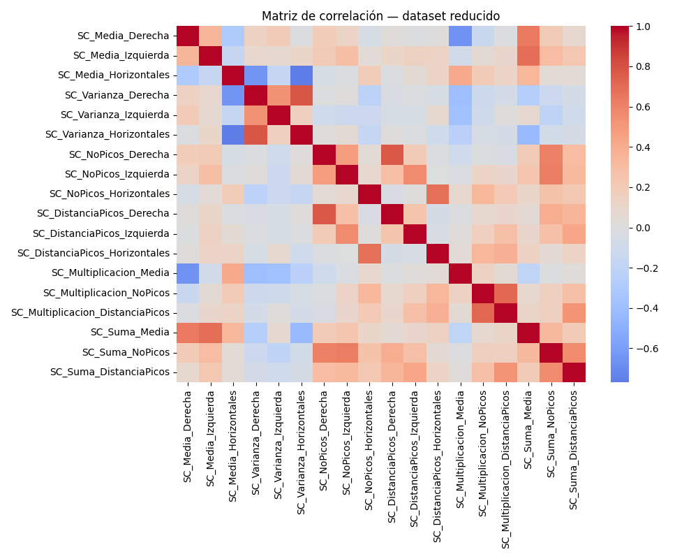
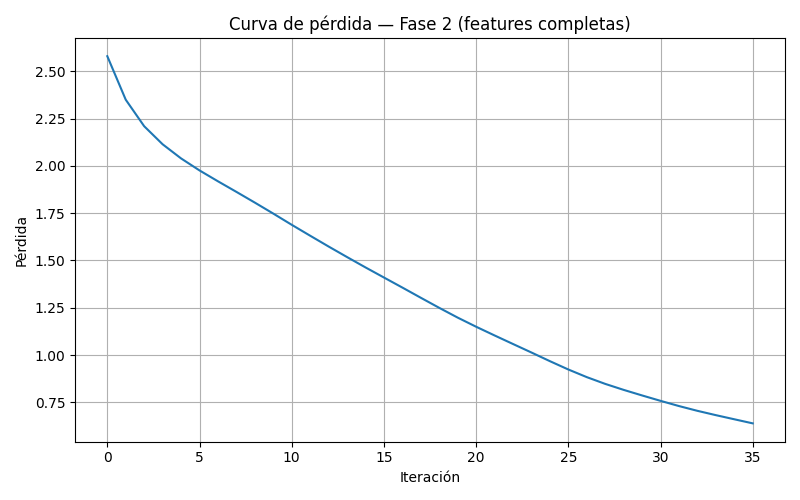
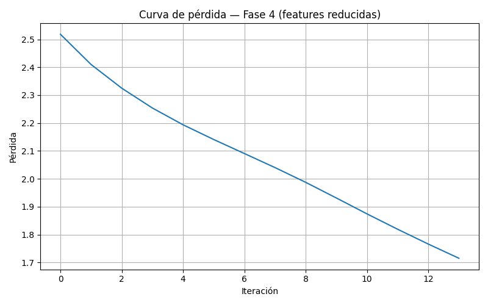
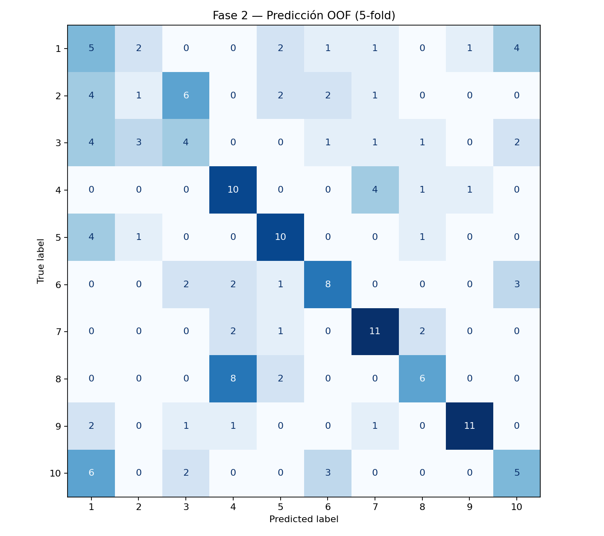
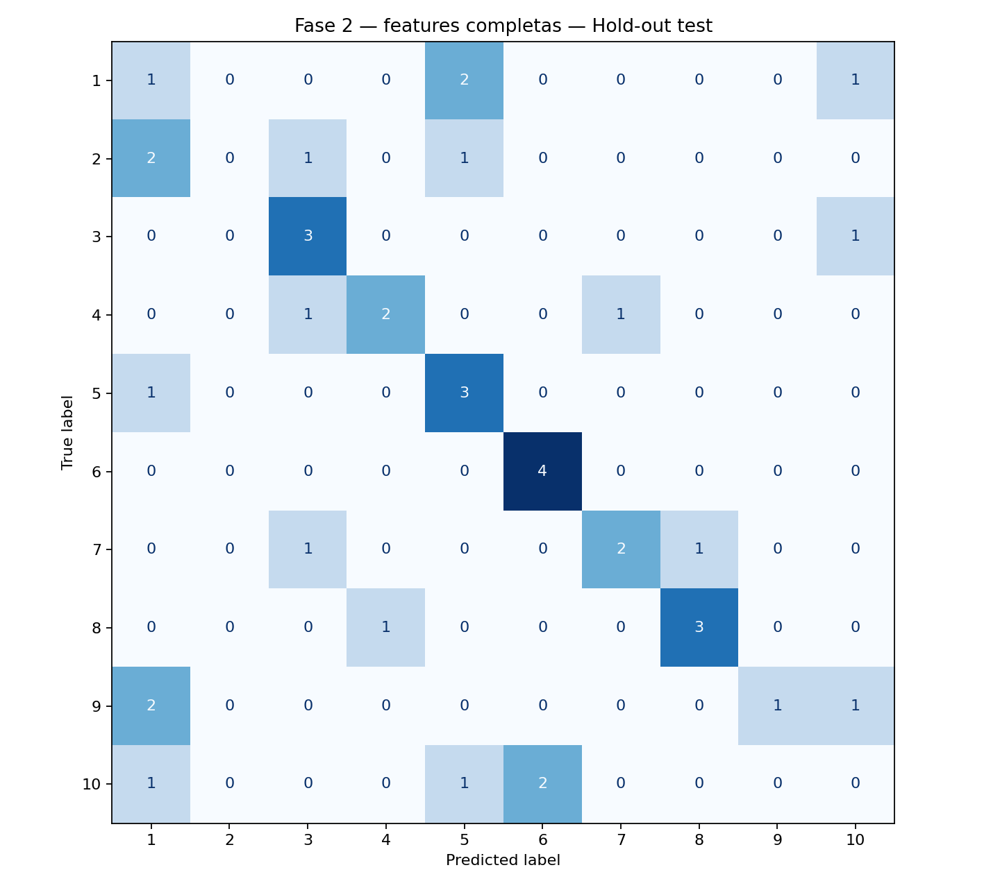
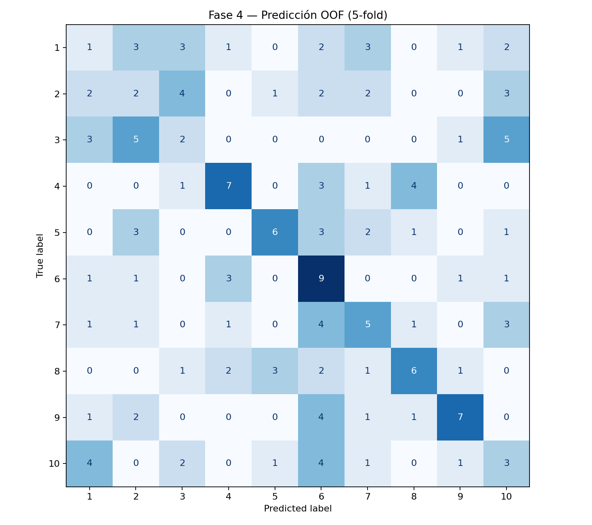
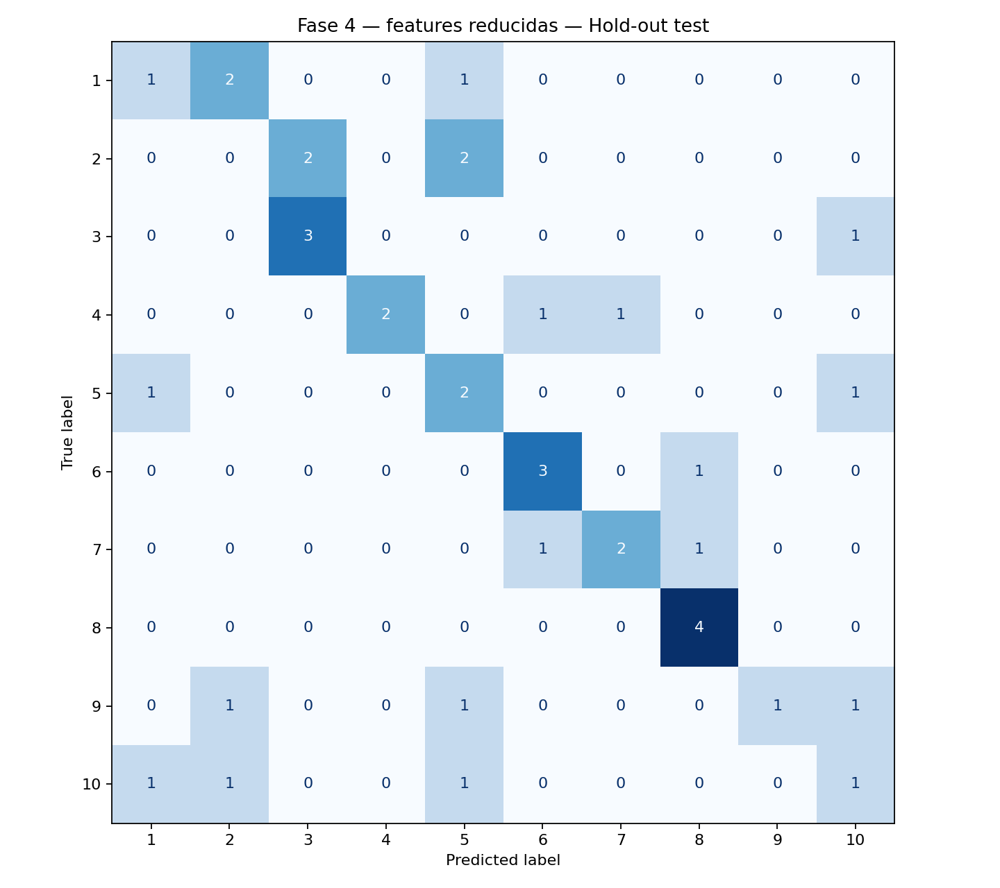

# Proyecto Final: Agrupamiento de Señales EOG del Lenguaje Blink-to-Speak

**Materia:** Minería de Datos  
**Equipo:** [Nombre integrante 1], [Nombre integrante 2], [Nombre integrante 3]  
**Fecha:** Mayo 2026  
**Script principal:** `src/pruebaK_fold.py`  
**Repositorio del proyecto:** [https://github.com/Cracksmity/dm-thesis-evaluation](https://github.com/Cracksmity/dm-thesis-evaluation) [4]

---

## Resumen ejecutivo

Se implementó un pipeline de clasificación con red neuronal multicapa (MLP) sobre el dataset EOG del artículo *EOG Signal Classification Based on Blink-to-Speak Language* [1], **excluyendo la variable `Longitud`** para evaluar si los diez patrones siguen siendo distinguibles sin esa característica dominante. El árbol de decisión (DT) del artículo alcanza **83.4 %** de accuracy con **19 características** (tras reducción por correlación que **conserva `Longitud`**). En este proyecto, el MLP con 29 características (sin `Longitud`) obtuvo **44.4 % ± 10.2 %** en validación cruzada y **47.5 %** en hold-out test; con 18 características reducidas, la CV cayó a **30.0 % ± 12.0 %** y el test se mantuvo en **47.5 %**. **Conclusión principal:** sin `Longitud`, los patrones **no** son identificables con la misma fiabilidad que en el artículo; la reducción por correlación **no mejoró** el MLP en CV y refleja redundancia entre descriptores estadísticos.

---

## 1. Contexto y objetivos

El artículo base propone clasificar diez patrones oculares del lenguaje Blink-to-Speak mediante descriptores estadísticos de señales EOG y un **árbol de decisión**, reportando **83.4 %** de accuracy. La variable **`Longitud`** actúa como característica muy discriminativa y puede inflar el desempeño, enmascarando la separabilidad real del resto de variables.

**Objetivos del proyecto (según instrucciones del curso):**

1. Aplicar un **MLP** para clasificar las 10 clases **sin usar `Longitud`**.
2. Explorar configuraciones del MLP mediante **GridSearchCV** y validación cruzada estratificada.
3. Reducir dimensionalidad eliminando características con **|r| > 0.8** (solo en entrenamiento).
4. Comparar resultados **antes y después** de la reducción.
5. Analizar críticamente si las clases del artículo son realmente identificables bajo estas condiciones.

**Referencia principal:** [1].

---

## 2. Dataset

| Propiedad                           | Valor                        |
| ----------------------------------- | ---------------------------- |
| Archivo                             | `data/DataSet_completo.xlsx` |
| Muestras                            | 200                          |
| Clases                              | 10 (etiqueta `Clase`)        |
| Muestras por clase                  | 20 (dataset balanceado)      |
| Características numéricas           | 30 (incluye `Longitud`)      |
| Características para MLP (proyecto) | 29 (sin `Longitud`)          |

Las columnas corresponden a descriptores por canal (derecha, izquierda, horizontales) y combinaciones (multiplicación y suma): media, varianza, desviación estándar, número de picos, distancia entre picos, diferencia máximo-mínimo, más agregados `SC_Multiplicacion_*` y `SC_Suma_*`.

**Distribución de clases (dataset completo):**

---

## 3. Metodología

El flujo experimental sigue las fases del enunciado y el script `src/pruebaK_fold.py` del repositorio del proyecto [4]. **No** se utiliza `src/CodFinTest.py` como referencia final, porque aplica la reducción por correlación sobre todo el dataset (riesgo de *data leakage*).

### 3.1 Fase 1 — Preprocesamiento

- Carga del Excel y eliminación de columnas totalmente vacías (`dropna(axis=1, how="all")`).
- Exclusión de **`Longitud`** y separación de la variable objetivo **`Clase`**.
- Análisis de balanceo de clases (gráfica anterior).
- Mapa de correlación sobre el conjunto de **entrenamiento** (sin `Longitud`):

### 3.2 División hold-out estratificada

- **80 % entrenamiento** (160 muestras) / **20 % prueba** (40 muestras, 4 por clase).
- `train_test_split(..., stratify=y, random_state=42)`.
- El conjunto de **prueba** no interviene en correlaciones, `GridSearchCV`, ni ajuste final.

### 3.3 Fase 3 — Correlación y reducción (solo train)

- Función `reducir_por_correlacion(X, umbral=0.8)`: si dos columnas tienen **|r| > 0.8**, se elimina una de ellas.
- Criterio aplicado **únicamente** sobre `X_train` para evitar filtración de información.
- Salida: `results/DataSet_reducido.xlsx` (train reducido + `Clase`).

### 3.4 Fases 2 y 4 — MLP

**Pipeline:** `StandardScaler` + `MLPClassifier` (activación ReLU, solver Adam) [2].

| Parámetro fijo        | Valor |
| --------------------- | ----- |
| `max_iter`            | 800   |
| `early_stopping`      | True  |
| `n_iter_no_change`    | 30    |
| `validation_fraction` | 0.1   |
| `random_state`        | 42    |

**Búsqueda de hiperparámetros (`GridSearchCV`, 5-fold estratificado interno):**

| Hiperparámetro       | Valores explorados          |
| -------------------- | --------------------------- |
| `hidden_layer_sizes` | (16, 8), (20, 10), (32, 16) |
| `alpha`              | 0.0001, 0.001, 0.01         |
| `learning_rate_init` | 0.001, 0.01                 |

**Mejores hiperparámetros encontrados (Fase 2, sobre train):**

| Parámetro                              | Valor seleccionado |
| -------------------------------------- | ------------------ |
| `hidden_layer_sizes`                   | **(32, 16)**       |
| `alpha`                                | **0.0001**         |
| `learning_rate_init`                   | **0.01**           |
| Accuracy media CV interna (GridSearch) | **0.444**          |

En la **Fase 4** se reutiliza el mismo estimador con `sklearn.base.clone` (mismos hiperparámetros), cambiando solo el número de entradas (18 features).

**Justificación de la rejilla:**

- **Arquitecturas pequeñas/medianas:** el dataset tiene 160 muestras de entrenamiento; redes muy profundas aumentan riesgo de sobreajuste.
- **`alpha` (L2):** controla la penalización de pesos grandes; valores probados cubren regularización débil a moderada.
- **`learning_rate_init`:** 0.001 favorece estabilidad; 0.01 acelera convergencia con mayor riesgo de oscilación.
- **Early stopping:** detiene el entrenamiento cuando la validación interna deja de mejorar (30 iteraciones sin mejora), útil para fijar la cantidad efectiva de épocas.

### 3.5 Métricas y validación

- **Validación cruzada estratificada 5-fold** sobre train (métricas por fold y promedios).
- **Predicciones out-of-fold (OOF)** en train para matrices de confusión sin sobreajuste de evaluación.
- **Hold-out test** independiente (20 %).
- Métricas reportadas: **Accuracy** (comparación con el artículo) y **F1 macro**.

---

## 4. Resultados

### 4.1 Tabla comparativa principal

| Escenario                       | Accuracy CV (media) | Desv. std CV | Accuracy test | F1 macro CV (media) | N° features |
| ------------------------------- | ------------------- | ------------ | ------------- | ------------------- | ----------- |
| **Fase 2** — MLP sin `Longitud` | 44.38 %             | 10.22 %      | **47.50 %**   | 41.55 %             | 29          |
| **Fase 4** — MLP reducido       | 30.00 %             | 12.02 %      | **47.50 %**   | 27.42 %             | 18          |
| **Artículo** — DT               | —                   | —            | **83.40 %** * | —                   | 19          |

\* Valor reportado en el artículo (referencia en código: `ARTICLE_DT_ACCURACY = 0.834`).

Fuente: `results/comparacion_resultados.csv`.

### 4.2 Desempeño por fold (train, validación cruzada)

**Fase 2 — todas las características (sin `Longitud`):**

| Fold      | Accuracy    | F1 macro    |
| --------- | ----------- | ----------- |
| 1         | 43.75 %     | 44.06 %     |
| 2         | 46.88 %     | 43.64 %     |
| 3         | 31.25 %     | 23.47 %     |
| 4         | 40.63 %     | 39.89 %     |
| 5         | 59.38 %     | 56.67 %     |
| **Media** | **44.38 %** | **41.55 %** |

**Fase 4 — características reducidas:**

| Fold      | Accuracy    | F1 macro    |
| --------- | ----------- | ----------- |
| 1         | 40.63 %     | 41.86 %     |
| 2         | 9.38 %      | 3.61 %      |
| 3         | 34.38 %     | 28.76 %     |
| 4         | 31.25 %     | 30.52 %     |
| 5         | 34.38 %     | 32.35 %     |
| **Media** | **30.00 %** | **27.42 %** |

La alta varianza entre folds (especialmente Fase 4, fold 2) es coherente con un dataset pequeño y un problema difícil sin `Longitud`.

### 4.3 Visualizaciones

**Curvas de pérdida y early stopping**

**Matrices de confusión**

| Fase | OOF (train)                                               | Hold-out test                                               |
| ---- | --------------------------------------------------------- | ----------------------------------------------------------- |
| 2    |  |  |
| 4    |  |  |

**Lectura de las matrices de test:** hay 10 clases y **4 muestras por clase** en test. La diagonal indica aciertos por clase; errores fuera de la diagonal muestran confusión entre patrones EOG similares. En ambas fases el desempeño en test (~47.5 %) está lejos del 83.4 % del DT y muestra dispersión de errores entre varias clases.

---

## 5. Características eliminadas

### 5.1 En el artículo (árbol de decisión, 19 features)

El dataset del classroom incluye **30** descriptores numéricos. El artículo entrena el DT con **19** variables tras un proceso de **selección por correlación** (el paper cita el uso de `corrcoef` y herramientas de clasificación en MATLAB). Aplicando el mismo criterio **|r| > 0.8** sobre las **30** columnas (incluyendo **`Longitud`**), se obtienen **exactamente 19** características retenidas y **11** eliminadas — consistente con el conteo usado en la comparación del proyecto.

**Características eliminadas en el artículo (11):**

1. `SC_Std_Derecha`
2. `SC_Std_Izquierda`
3. `SC_Std_Horizontales`
4. `SC_DifMaxMin_Derecha`
5. `SC_DifMaxMin_Izquierda`
6. `SC_DifMaxMin_Horizontales`
7. `SC_Multiplicacion_Varianza`
8. `SC_Multiplicacion_Std`
9. `SC_Multiplicacion_RMS`
10. `SC_Suma_Varianza`
11. `SC_Suma_Std`

**Características retenidas en el artículo (19):**

`SC_Media_Derecha`, `SC_Media_Izquierda`, `SC_Media_Horizontales`, `SC_Varianza_Derecha`, `SC_Varianza_Izquierda`, `SC_Varianza_Horizontales`, `SC_NoPicos_Derecha`, `SC_NoPicos_Izquierda`, `SC_NoPicos_Horizontales`, `SC_DistanciaPicos_Derecha`, `SC_DistanciaPicos_Izquierda`, `SC_DistanciaPicos_Horizontales`, **`Longitud`**, `SC_Multiplicacion_Media`, `SC_Multiplicacion_NoPicos`, `SC_Multiplicacion_DistanciaPicos`, `SC_Suma_Media`, `SC_Suma_NoPicos`, `SC_Suma_DistanciaPicos`.

La variable **`Longitud`** es central en el modelo del artículo y **no** se elimina en esa selección.

### 5.2 En este proyecto (sin `Longitud`, umbral 0.8 en train)

Se eliminan las **mismas 11** columnas listadas arriba (la lista es idéntica al aplicar el umbral sobre 29 o 30 variables, porque ninguna de las eliminadas es `Longitud`). Tras la reducción quedan **18** características para la Fase 4 (29 − 11).

---

## 6. Fase 5 — Análisis crítico (preguntas del enunciado)

### 6.1 ¿Los 10 patrones del artículo realmente son identificables sin usar longitud?

**No de forma fiable** con el MLP implementado. El DT del artículo alcanza **83.4 %** usando 19 variables que **incluyen `Longitud`**. Al excluirla, el MLP obtiene **47.5 %** en test (y **44.4 %** en CV), muy por debajo del referente y cercano a un escenario de fuerte confusión entre clases en un problema de 10 etiquetas. Las matrices de confusión muestran errores distribuidos en varias clases, no un patrón diagonal dominante.

Esto confirma la hipótesis del enunciado: **`Longitud` facilita en gran medida la separación** reportada en el artículo; los demás descriptores por sí solos no reproducen ese nivel de discriminación.

### 6.2 ¿Qué tanto ayudaron o perjudicaron las características originales (29 sin `Longitud`)?

**Ayudaron** al ofrecer más información que la versión reducida: la Fase 2 supera a la Fase 4 en CV (**44.4 %** vs **30.0 %**) y en F1 macro (**41.6 %** vs **27.4 %**). Sin embargo, muchas variables son **redundantes** (alta correlación entre std, varianza, RMS y sumas/multiplicaciones derivadas), lo que puede aumentar varianza del modelo y dificultar el entrenamiento.

En test ambas fases empatan (**47.5 %**), lo que debe interpretarse con cautela: el test solo tiene **40** muestras y la estimación tiene alta varianza.

### 6.3 ¿La eliminación de características correlacionadas mejoró o empeoró la clasificación?

**Empeoró** según la validación cruzada en train (**30.0 %** vs **44.4 %**). En hold-out test no hubo cambio (**47.5 %** en ambos casos). Conclusión: la reducción eliminó sobre todo **redundancia**, pero también información útil para el MLP sin `Longitud`; no sustituye el papel discriminativo de `Longitud` que el artículo explota en su conjunto de 19 variables.

### 6.4 ¿Qué limitaciones del artículo se evidenciaron en este proyecto?

1. **Dependencia de `Longitud`:** el alto desempeño del DT está ligado a una característica dominante; sin ella cae la separabilidad práctica.
2. **Redundancia entre descriptores:** media/varianza/std y features combinadas repiten información; el artículo ya reduce 30 → 19, pero el problema sigue siendo difícil para modelos sin `Longitud`.
3. **Un solo modelo de referencia (DT):** no compara MLP ni valida con el mismo protocolo hold-out; este proyecto muestra que un MLP no lineal tampoco recupera el 83.4 % sin `Longitud`.
4. **Dataset pequeño (200 muestras):** la CV presenta desviaciones de ~10–12 puntos porcentuales; el test por clase es de solo 4 muestras.
5. **Ingeniería manual de características:** la clasificación depende de descriptores calculados, no de la señal cruda; limita generalización a otros equipos o condiciones.

### 6.5 ¿El dataset está bien construido para un problema de clasificación? Justificación

**Parcialmente sí.**

**Aspectos positivos:**

- Clases **balanceadas** (20 muestras por patrón).
- Cobertura de canales y estadísticas alineada con el dominio EOG.
- Permite reproducir el experimento del artículo y contrastar modelos.

**Aspectos problemáticos:**

- **Alta multicolinealidad** entre descriptores.
- **Tamaño muestral reducido** para 10 clases y un MLP con búsqueda de hiperparámetros.
- **Separabilidad insuficiente** sin `Longitud` para un clasificador robusto (evidencia empírica en este trabajo).
- Posible **similitud entre patrones** Blink-to-Speak (confusiones en matrices).

**Veredicto:** el dataset es adecuado como banco de pruebas académico alineado al paper, pero **limitado** para afirmar que las 10 clases son naturalmente separables sin características dominantes o sin más datos.

---

## 7. Conclusiones

1. El pipeline en `src/pruebaK_fold.py` [4] cumple las fases solicitadas: preprocesamiento, MLP con validación, reducción por correlación en train, MLP reducido y comparación con el DT del artículo [1].
2. **Sin `Longitud`, el MLP no iguala el 83.4 % del artículo** (47.5 % test vs 83.4 % referencia).
3. La reducción por correlación **degradó** el desempeño en CV; las 11 variables eliminadas coinciden con las que el artículo descarta al pasar de 30 a **19** features, pero el artículo **conserva `Longitud`** y este proyecto no.
4. El uso de **escalado z-score**, **GridSearchCV**, **early stopping** y **hold-out estratificado** hace la evaluación más rigurosa que una sola partición informal.

---

## 8. Entregables

| Entregable | Ubicación |
|------------|-----------|
| Informe (PDF/Word) | `docs/INFORME_PROYECTO_FINAL.md` / `.docx` |
| Dataset reducido | `results/DataSet_reducido.xlsx` |
| Código ejecutable | `src/pruebaK_fold.py` |
| Figuras y tablas | `results/figures/`, `results/*.csv` |
| Repositorio | [https://github.com/Cracksmity/dm-thesis-evaluation](https://github.com/Cracksmity/dm-thesis-evaluation) [4] |

**Ejecución:** `python src/pruebaK_fold.py` (desde la raíz del repositorio [4]).

---

## 9. Referencias

[1] M. C. Padilla-Becerra, D. K. Macias-Castro, R. A. Salido-Ruiz, S. Torres-Ramos, and I. Román-Godínez, "EOG Signal Classification Based on Blink-to-Speak Language," in *Proc. XLVI Mexican Conf. Biomed. Eng. (CNIB 2023)*, IFMBE Proc., vol. 96, Cham, Switzerland: Springer, 2024, pp. 249–257, doi: [10.1007/978-3-031-46933-6_27](https://doi.org/10.1007/978-3-031-46933-6_27).

[2] F. Pedregosa et al., "Scikit-learn: Machine Learning in Python," *J. Mach. Learn. Res.*, vol. 12, pp. 2825–2830, 2011.

[3] Blink to Speak, "Blink to Speak Language," [Online]. Available: [https://www.blinktospeak.com/](https://www.blinktospeak.com/). Accessed: May 2023. (Citado en [1].)

[4] Cracksmity, "dm-thesis-evaluation: Evaluación de modelos MLP para clasificación EOG," GitHub repository, 2026. [Online]. Available: [https://github.com/Cracksmity/dm-thesis-evaluation](https://github.com/Cracksmity/dm-thesis-evaluation)

---

## Anexo A — Cobertura de la rúbrica (100 puntos)

| Criterio | Puntos | Evidencia en este informe |
|----------|--------|---------------------------|
| Preprocesamiento (normalización + eliminación de longitud) | 15 | §3.1, §3.4 `StandardScaler`, exclusión de `Longitud` |
| Aplicación correcta de MLP (fase inicial) | 15 | §3.4 Fase 2, hiperparámetros §3.4 |
| Evaluación del MLP con métricas | 10 | §4.1, §4.2, tablas CSV |
| Análisis de correlación y selección | 10 | §3.3, §5, figuras correlación |
| MLP con características reducidas | 15 | §3.4 Fase 4, §4.1 |
| Visualizaciones claras | 10 | §4.3, §2 (fig_clases) |
| Interpretación y análisis crítico | 20 | §6 (5 preguntas con cifras) |
| Presentación general del reporte | 5 | Estructura completa, tablas, figuras embebidas |
